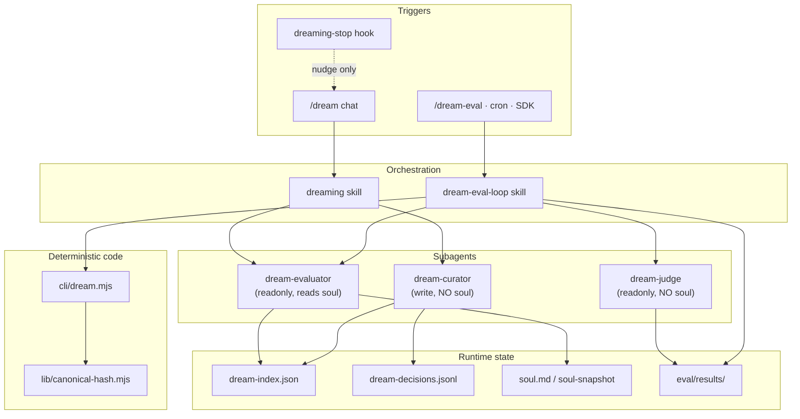

# Dreaming & dream-eval — system overview

**Single source of truth for the continual-learning and quality-gate pipeline.**  
Maintained in [utrecht-data-os](https://github.com/OnlineChefGroep/utrecht-data-os) at `docs/ops/dreaming/`.  
Published integration kit: [OnlineChefGroep/dreaming-sdk](https://github.com/OnlineChefGroep/dreaming-sdk).

---

## What is dreaming?

**Dreaming** is a broad, manual, soul-driven pass over past agent sessions. It reads the *shape* of conversations — recurrence, not raw content — and proposes durable memory updates: `AGENTS.md` bullets, skills, subagents, and rules. Nothing is written without explicit user approval.

**Dream-eval** is the unattended quality gate for that pipeline. It runs the same evaluator and judge subagents against a **golden corpus** of labeled transcripts, produces faithfulness and precision/recall scores, and writes metrics to an isolated results directory. Eval never mutates live memory.

| Loop | Trigger | Writes | Subagents |
|------|---------|--------|-----------|
| **Live `/dream`** | Chat, hook nudge | `~/.cursor/dreaming/`, `AGENTS.md` | evaluator → curator |
| **Eval (`dream-eval-loop`)** | Cron, SDK, `/dream-eval` | `eval/results/<run_id>/` only | evaluator → judge |
| **Nightly dry-run** | Cron (pending ≥ 5) | Report to `dreams/` only | evaluator (readonly) |

**Latest baseline:** run `2026-06-15T07-17-00Z`, judge faithfulness **0.63**. See [eval-quality.md](./eval-quality.md).

---

## Architecture



Deep dive: [architecture.md](./architecture.md).

---

## Live `/dream` vs eval loop vs nightly automation

| Surface | Skill | Schedule | Mutates live state? |
|---------|-------|----------|---------------------|
| `/dream` | `dreaming` | On demand | Yes (after user approval) |
| `/dream-eval` | `dream-eval-loop` | On demand | No |
| Weekly quality gate | `dream-eval-loop` | Mon 09:00 cron | No |
| Nightly dry-run | `dreaming` (dry-run) | Daily 00:00 cron | No |
| SDK / CI | `dream-eval-loop` via prompt | Configurable | No |

The **dreaming-stop hook** is advisory only — it suggests `/dream` when pending sessions exceed a threshold. It does not run eval or automations.

Chain handoffs and entry points: [skills-bundle/shared/chain-reference.md](../skills-bundle/shared/chain-reference.md).

---

## Multi-agent support

The dreaming **plugin** is the runtime SSOT (`~/.cursor/plugins/local/dreaming/`). The **skills bundle** provides portable orchestration markdown for each agent host.

| Platform | Install path | One-liner |
|----------|--------------|-----------|
| **Cursor** | `~/.cursor/skills/dream-eval-loop/` | Already installed; sync from bundle on release |
| **Claude** | `.claude/skills/dream-eval-loop/` | `.\skills-bundle\install-dream-skills.ps1 -Platform claude -Target .` |
| **Codex** | `.agents/skills/dream-eval-loop/` | `.\skills-bundle\install-dream-skills.ps1 -Platform codex -Target .` |
| **OpenCode** | `.opencode/skills/dream-eval-loop/` | `.\skills-bundle\install-dream-skills.ps1 -Platform opencode -Target .` |
| **Grok / Factory** | `.factory/skills/dream-eval-loop/` | `.\skills-bundle\install-dream-skills.ps1 -Platform grok -Target .` |

**Trigger (all platforms):** "Apply the dream-eval-loop skill to run one golden corpus evaluation pass."

Full per-platform matrix: [multi-agent.md](./multi-agent.md) · Install guide: [skills-bundle/README.md](../skills-bundle/README.md).

---

## File locations

| What | Path |
|------|------|
| **Plugin (runtime SSOT)** | `~/.cursor/plugins/local/dreaming/` |
| **Live runtime state** | `~/.cursor/dreaming/` — index, decisions, dream reports |
| **Eval orchestrator skill (Cursor)** | `~/.cursor/skills/dream-eval-loop/` |
| **Automation prefill** | `~/.cursor/skills/dream-eval-loop/automations.json` |
| **Repo-local override (W2)** | `<repo>/.cursor/dreaming/` |
| **Docs (this tree)** | `docs/ops/dreaming/` |
| **Skills bundle** | `docs/ops/dreaming/skills-bundle/` |
| **GitHub integration kit** | https://github.com/OnlineChefGroep/dreaming-sdk |

**Never commit:** live `dream-index.json`, `dream-decisions.jsonl`, transcripts with PII, or secrets.

---

## Quick start

### 1. Install the plugin

Copy or sync the dreaming plugin to `~/.cursor/plugins/local/dreaming/`. Verify:

```powershell
node $env:USERPROFILE\.cursor\plugins\local\dreaming\cli\dream.mjs test --json
```

### 2. Install eval skills (non-Cursor hosts)

From this repo:

```powershell
& docs\ops\dreaming\skills-bundle\install-dream-skills.ps1 -Platform codex -Target .
```

### 3. Run one eval pass

In Cursor: `/dream-eval` or apply the `dream-eval-loop` skill.  
Elsewhere: prompt with the trigger text above.

### 4. Schedule (Cursor)

Open Automations and prefill from `automations/dream_eval_weekly.json` in [dreaming-sdk](https://github.com/OnlineChefGroep/dreaming-sdk), or use MCP `open_automation`. Details: [operations.md](./operations.md).

---

## Child documents

| Doc | Contents |
|-----|----------|
| [architecture.md](./architecture.md) | Soul, index, decisions log, schemas, hash rules |
| [agent-memory.md](./agent-memory.md) | CHEF-308 Postgres memory layer, Linear/Notion, OCI |
| [sdk-integration.md](./sdk-integration.md) | Cursor SDK, npm phases, HTTP/webhook, CI |
| [multi-agent.md](./multi-agent.md) | Claude, Codex, OpenCode, Grok consumption |
| [eval-quality.md](./eval-quality.md) | Golden corpus, metrics, judge faithfulness, known weaknesses |
| [operations.md](./operations.md) | Automations, CLI cheat sheet, troubleshooting |
| [quickstart.md](./quickstart.md) | Contributor setup and local quality gate |
| [maintainer-guide.md](./maintainer-guide.md) | Review, merge, dependency, and incident practices |
| [release-process.md](./release-process.md) | Release checklist and artifact build flow |
| [oss-readiness.md](./oss-readiness.md) | Public readiness checklist and remaining decisions |
| [GITHUB-README.md](./GITHUB-README.md) | README for the dreaming-sdk repo |
| [skills-bundle/](../skills-bundle/) | Portable multi-agent skill scaffold |

---

## Package boundaries

```
dreaming plugin (local install)
  cli/ · lib/ · skills/ · schema/ · eval/ · hooks/ · sdk/
        │
        ▼ documents + thin wrappers
dreaming-sdk (GitHub)
  docs/ · skills-bundle/ · automations/ · python/ · LICENSE
  bin/dream.js · lib/ · sdk/run-dream-cloud.ts · schema/
        │
        ▼ published CLI
@onlinechefgroep/dream-cli (npm)
```

The plugin holds subagent prompts, golden corpus, hooks, and canonical-hash logic. The SDK repo holds integration artifacts only — not a fork of the plugin.

---

## Organization

Maintained by [OnlineChefGroep](https://github.com/OnlineChefGroep). Private repos — do not commit secrets, PII transcripts, or live decision logs.
